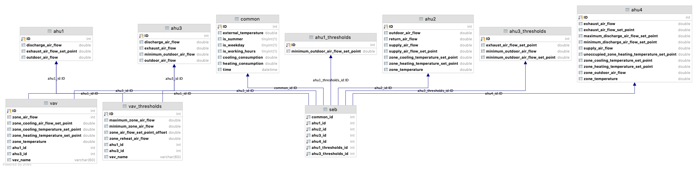

# Data Processor 

This is an application that imports data (in CSV format) collected by Voltron into a database and normalizes it.

***
## [CSV File Demo](#CSV-file-demo)

 [seb_processed_data_sample.csv](help/seb_processed_data_sample.csv) 

***
## [DB Schema](#DB-schema) 

***
## [Usage](#usage)

1. Change the path of CSV file in the `edu.neu.cs6510.pnnl.hunting.controller.DataProcessorApp#main`
2. Set the DB infomation in the `src/main/resources/mybatis-config.xml`

3. Run `DataProcessorApp.main()`

***
## [Tips and tricks](#tips-and-trick)

- It is recommended to do the import operation locally, after finishing the import, you can use `mysqldump` to dump the database and use `mysql` to restore it on the remote server
- If you need to split the `vav` table, please use another project of this project `alert-service`. The service is developed based on this project, but the `vav` table has been split to improve read and write efficiency

***
## [License](#license)

Data Processor is provided under the  [GNU General Public License v3.0](https://github.com/PNNL-Project/data-importers/blob/master/LICENSE).

