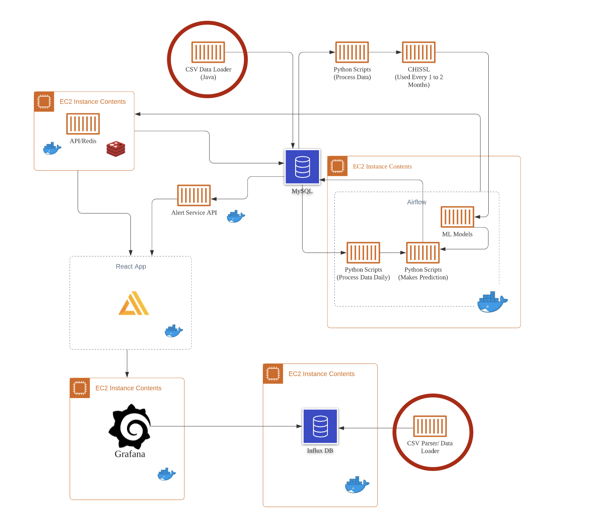

# data-importers

Repository containing code repos for data import functionality

* **DataProcessor**: Imports normalized data into MySQL DB
* **pnnl-csvParser-for-influxdb**: Parses the original CSV in preparation to import into Influx
* **pnnl-csvToInflux-importer**: Imports the processed data after utilizing *pnnl-csvParser-for-influxdb*

Below is a visual of how they fit within the system design:
